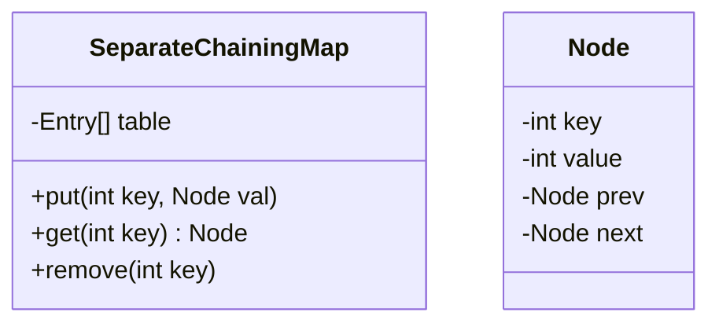

# Design Requirements - Xiangtuo Cui

## 1. Why did I choose Option C?
"Try clearing your cache" is an oft-spoken phrase anytime a website doesn't load. But currently, I don't really know what browser cache is and how it works. Option C can teach me.

## 2. Analysis of the Problem
The purpose of cache is to quickly retrieve website data. Hence, my implementation of cache has two requirements:
1. Cache should have a O(1) retrieval  to quickly load website data. Cache is pointless if it loads just as slow as downloading from the server itself. 
2. Cache must be able to constantly evolve. This is because cache data that isn't used frequently would be deleted to save disk space, while newly-visited websites would add new pieces of data to cache.  

To build browser cache, I can choose between two data structures, HashMap combined with a Doubly Linked List (LRU Cache pattern) or Dynamic Arrays. I know that a __HashMap__ provides O(1) average time complexity for searching keys, satisfying my need for fast retrieval time. I know that a __Doubly Linked List__ allows for quick O(1) additions and deletions at the ends of the list, satisfying my need for frequent updates to cache. Hence, the HashMap combined with a Doubly Linked List is my favored method to implementbrowser  cache. 

## 3. UML Diagram 

## 4. Big-O Expectations

__Get() operation__: Used when cache is loading website data. This operation has time complexity O(1) because a hash map provides instant lookup of keys.

__Put() operation__: Used when new cache data is added or cache data must be updated. This operation has time complexity O(1) because adding new nodes to the head or removing from the tail of a linked list is a constant-time oepration. 
